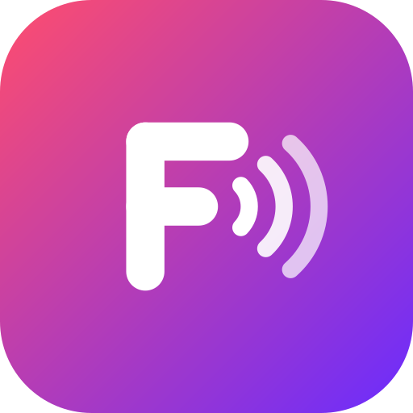

<p align="center"></p>

# FLACie

A music player for Android phones, foldables and handhelds (built on an Anbernic RG Rotate) that streams from
Jellyfin, Plex and a NAS, downloads through Lidarr and Soulseek — and syncs and edits a classic iPod, either plugged
straight into the phone over USB or into a PC.

| Folder | What | Built with |
|---|---|---|
| [`android/`](android/) | **FLACie for Android**: Modern (default) and iPod-style themes, lyrics, account sync, Sync mode for editing an iPod. The iPod engine is built in (`app/src/main/jniLibs`). | Kotlin, Jetpack Compose, Gradle |
| [`ipodsync/`](ipodsync/) | **The iPod engine** (reading, the verified writer, database signatures), the **FLACie desktop app** (Windows) with its installer, a web host, a CLI, and `IpodSync.Engine` — the engine as a native library for the Android app. | C#/.NET 9, MAUI, NativeAOT |
| [`logo/`](logo/) | The FLACie logo (SVG master). | |

## FLACie Web (self-hosted)

The same player in a browser, and the same look as the phone app: search on top, your playlists in the sidebar, a full-screen player with
Autoplay, an Up next that shows what actually plays next, synced lyrics, a file-info tab (format, bit rate, sample rate), and a
"Listening on <device>" strip when another player on your Jellyfin account is playing. It is a small ASP.NET server (`ipodsync/src/FLACie.Server`,
built on `ipodsync/src/FLACie.Core`) and a multi-arch image: `ghcr.io/asch-bh08/flacie-web`.

**Sign in** with Jellyfin (a password, or Quick Connect: approve the six-digit code in any signed-in Jellyfin app) or, if allowed, a NAS (an SMB
share). The profile (services, playlists, favourites, preferences) lives in your Jellyfin user settings and on the NAS share
(`.flacie/profile-<user>.json`), the same place the phone app keeps it, so everything follows you between devices.

```yaml
# docker-compose.yml
services:
  flacie:
    image: ghcr.io/asch-bh08/flacie-web:latest
    container_name: flacie
    restart: unless-stopped
    ports:
      - "8080:8080"
    volumes:
      - ./flacie-data:/data        # sign-in keys, cover and lyrics cache
    environment:
      PUID: "1000"                         # optional: run as your own user (find yours with `id`)
      PGID: "1000"
      FLACIE_JELLYFIN_URL: "https://jellyfin.example.com"   # optional: lock sign-in to one server (users then only type a username)
      # FLACIE_JELLYFIN_INTERNAL_URL: "http://jellyfin:8096" # optional: where the server itself reaches Jellyfin, if that differs from the address above
      FLACIE_ALLOW_NAS_LOGIN: "false"      # optional: Jellyfin only. Recommended on a public site: a NAS sign-in makes the server connect to any address typed in.
```

Then `docker compose up -d` and open `http://<host>:8080`.

**Behind a reverse proxy or Tailscale Funnel.** The app reads `X-Forwarded-For/Proto/Host`, so it works behind Caddy, Nginx, Traefik or a Funnel with no
extra setting: proxy a hostname (not a sub-path) to port 8080 and make sure WebSockets are passed through (Blazor needs them). Caddy needs only
`flacie.example.com { reverse_proxy flacie:8080 }`. With Tailscale Funnel on a host that already uses port 443, give it its own HTTPS port:
`tailscale funnel --bg --https=8443 http://127.0.0.1:8080`.

**Downloads from the web.** Search shows music you don't have under "More music", with Download buttons: Soulseek (slskd plus the small file
mover) first, Lidarr as the fallback. The addresses and keys are read from your profile (set them in the phone app, or in Settings > Downloads on
the web) and stay on the server; the browser only sees progress.

**Connect and Jams.** Signed in with Jellyfin, the browser appears as a device next to your phone: control it from the phone, take over what the
phone plays, or start/join a Jam (Jellyfin SyncPlay; each user needs SyncPlay access in Dashboard > Users). A token that was borrowed from the
shared profile is replaced by one of the device's own (via an approved Quick Connect request), so every device shows up on its own.

## FLACie on Windows

The Windows desktop app now opens on the music player: the same FLACie Web server, packaged next to the app (`flacie-web` folder) and shown
inside the window, so the look and the features are identical to the web. A switch at the top changes between **FLACie** and the **iPod manager**
(the iPod tools described in `ipodsync/README.md`). The player's data (sign-in keys, caches) lives in `%LOCALAPPDATA%\FLACie\web`; it only listens on
127.0.0.1 and stops with the app. `ipodsync\tools\build-apps.ps1 -Windows` (and the installer) publishes it into the app folder.

## Building

- **Android app:** `cd android && ./gradlew assembleRelease` (JDK 17, Android SDK). See [android/README.md](android/README.md).
- **iPod engine for the Android app** (only when `ipodsync/src/IpodSync.Core` changes): on Linux or WSL,
  `ipodsync/tools/build-engine-android.sh` — rebuilds `libipodsync.so` straight into `android/app/src/main/jniLibs`.
- **Windows desktop app + installer:** `powershell -File ipodsync\tools\build-installer.ps1` → `FLACie-<version>-windows-x64.msi`.
- Safety rules for anything that writes to an iPod: [ipodsync/EDIT-PROTOCOL.md](ipodsync/EDIT-PROTOCOL.md) — back up first, dry-run first,
  verify after, restore on failure, and `tools/fake-root-regression.sh` before changing the write path.

## History

This repository was `ipodplayer` (the Android app); `ipodsync` was merged in with its full history under `ipodsync/`.
Older releases of each live on their original release pages.

## Privacy

FLACie has no analytics, ads or tracking. It talks to the servers you set up (Jellyfin, Plex, NAS, Lidarr, slskd, file mover),
plus two public lookups that send only an artist and song or album name: [LRCLIB](https://lrclib.net) for lyrics and the
iTunes Search API for covers that your servers don't have. Signing in to an account stores your service connections
(including passwords and API keys) in your Jellyfin user settings on your own server.

## Background playlist import, charts and Autoplay (FLACie Web)

- **Import:** FLACie Web's *Import* page (or Settings > Background downloads in the Android app) takes an iTunes `Library.xml`, an M3U, a Spotify CSV or a text file (`## Playlist (N tracks)` headings, `Artist - Title` lines). The server searches and downloads in the background (three songs at a time, paused while the music storage has less free space than Settings > Background says) and fills account playlists as songs arrive. The phone only sends the file (`POST /api/import`, authenticated with its Jellyfin token) and reads progress (`GET /api/import`).
- **Daily charts:** Settings > Background downloads can follow iTunes charts (overall and by genre); once a day it downloads songs you don't have while there is room, and rebuilds "Charts: ..." playlists. Nothing is ever deleted.
- **Autoplay:** when the queue ends it adds different songs: the artist's others and those of similar artists (MusicBrainz + ListenBrainz listening data, songs from Deezer), and fetches the next few you lack.
- **Storage:** Settings > Storage shows the music storage's free space, the server's disk and data folder, and (on request) the Jellyfin library size.
